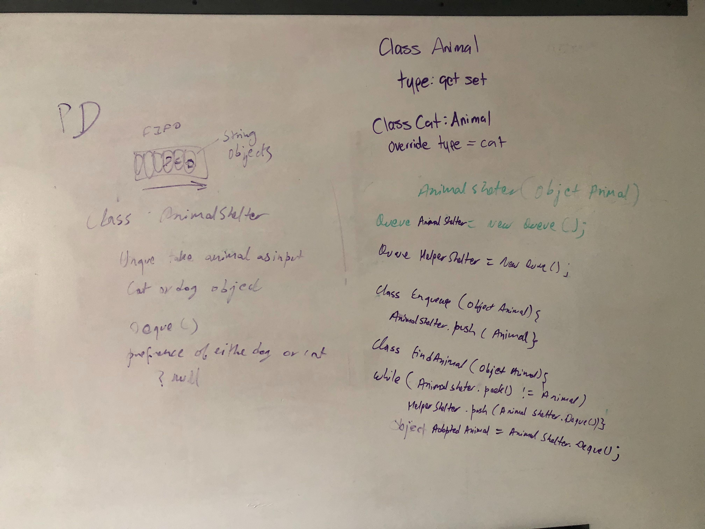
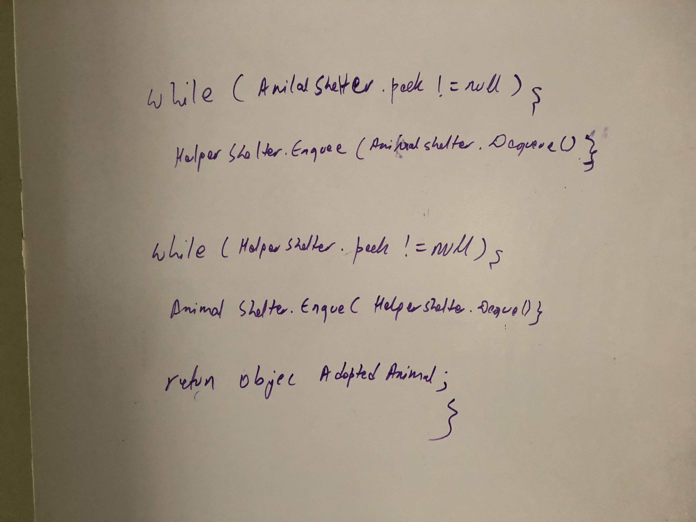

# Code Challenge 12: FIFO Animal Shelter
 - First-in, First out Animal Shelter.
## Challenge
- Create a class called AnimalShelter which holds only dogs and cats. The shelter operates using a first-in, first-out approach.
- Implement the following methods:
  - enqueue(animal): adds animal to the shelter. animal can be either a dog or a cat object.
  - dequeue(pref): returns either a dog or a cat. If pref is not "dog" or "cat" then return null.
  - STRETCH: If a cat or dog isn’t preferred, return whichever animal has been waiting in the shelter the longest.
### Structure and Testing
- Utilize the Single-responsibility principle: any methods you write should be clean, reusable, abstract component parts to the whole challenge. You will be given feedback and marked down if you attempt to define a large, complex algorithm in one function definition.

- Write at least three test assertions for each method that you define.

- Ensure your tests are passing before you submit your solution.

## Approach & Efficiency
### Approach

### Building APIs
- I first decided to build by Animal class with Cat and Dog clases as children. I was initially going to use a node class that takes an object but decided later to just modify the imported Queue class to accept Animal objects instead.
### Building Animal Shelter
- I first created two queues called animalShelter and helperShelter.
#### Enqueue
- I then created the enqueue method with takes a AnimalType enum and a string name. 
- It will first check the AnimalType then create either a dog or cat object with the input name.
- Them it will enqueue the created animal into the animalShelter.
#### Dequeue
- I then created the dequeue method which takes an AnimalType as an input.
-  I then created a bool called foundAnimal to help with the STRETCH goal. ;)
- I then check to see if the animalShelter is empty and return null if it is.
- I then check to see if we are lucky and the animalType that we want is at the front of the animalShelter queue and will adopt the animal and switch found animal to true. This allows a dequeue with O(1) time.
_ If we werent lucky then it will run a while loop that will continue running until the animalType is found. 
    - As its doing this it is adding any animal that doesnt match to the helperShelter.
- After the loop has finished if the animal is found in the shelter it will be adopted and foundAnimal = true;
- Then a cleanup loop will run and will add the rest of the animals in the animalShelter to the helperShelter.
- After the animalShelter is empty another loop will run adding all of the animals back into the animalShelter so that their age in the queue is maintained.
- STRETCH GOAL: After all of the loops have concluded an if statement will run to check if the target animal was found. 
    - If the animal wasn't found then you will adopt the oldest animal in the animal shelter.
- Then the adopted animal is returned.

### Efficiency
#### Enqueue method
#### Space
O(1)
#### Time
O(1)

#### Dequeue method
##### If Preferred Animal is found at in front of queue
#### Space
O(1)
#### Time
O(1)
##### If Preferred Animal is NOT found at in front of queue
#### Space
O(1)
#### Time
O(N)
## Whiteboard

- Whiteboard Author: Dev Shrestha 

## API
### AnimalShelter Required Classes
- Animal Shelter Requirements;
  - Animal class (also acts as node for the queue.)
  - Dog class
  - Queue class