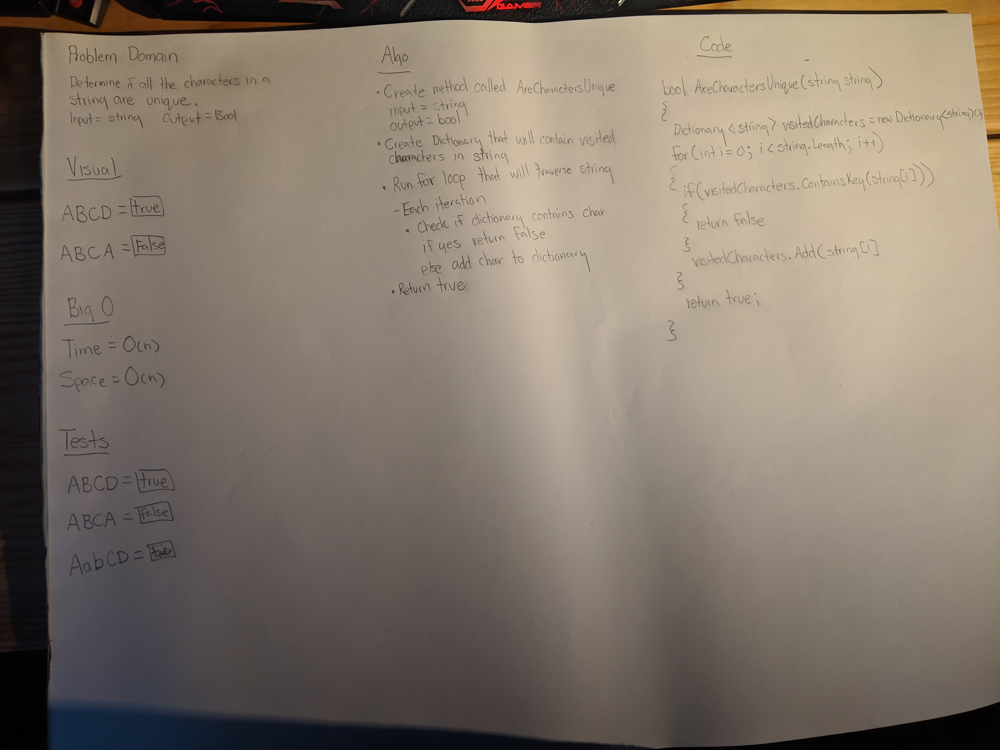

# Snow Day Challenge: Are Characters in a String Unique
 - Determine if all characters in a string are unique.
## Challenge
- Implement a method with the following signature bool AreCharactersUnique(string input) that returns true if all the characters in the string are unique.
### Structure and Testing
- Utilize the Single-responsibility principle: any methods you write should be clean, reusable, abstract component parts to the whole challenge. You will be given feedback and marked down if you attempt to define a large, complex algorithm in one function definition.

- Write at least three test assertions for each method that you define.

- Ensure your tests are passing before you submit your solution.

## Approach & Efficiency
### Approach
- I created the method bool AreCharactersUnique(string input)
  - I then created a Dictionary that takes characters as input called vistedCharacters that will keep track of visited characters. 
  - I then created a for loop that interates through the string input.
    - If the visitedCharacter Dictionary contains the input[i] the method returns false.
    - Else I add input[i] to the visitedCharacter Dictionary.
  - If the for loop completed True is returned.
    
### Efficiency
#### Space
O(n)
#### Time
O(n)

## Whiteboard
