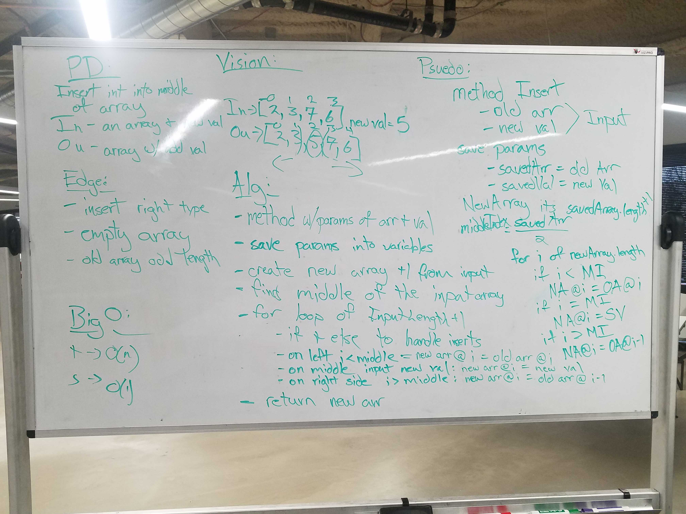
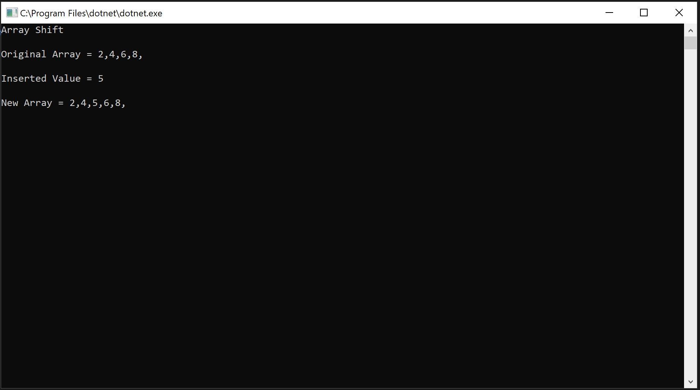

# Code Challenge 02: Array Shift
 - Insert and shift an array in middle at index
## Challenge
- Write a function called insertShiftArray which takes in an array and the value to be added. Without utilizing any of the built-in methods available to your language, return an array with the new value added at the middle index.
## Approach & Efficiency
### Approach
- I first approached this as a JS challenge but quickly realized that you have to manually manipulate the array to insert a value.
- To acheive this I decided to make a copy of the input array. 
- I then determined the middle index by creating a variable that queried the array's length and divided it by 2.
- I then created a new empty array with a length of the original array + 1.
- I then created a FOR loop that stops one index before the middle index and populated the newArray[i] with the inputArray[i].
- I then inserted the new value into the newArray[middleIndex].
- I then created a FOR loop that starts at the index after the middle index populated the newArray[i] with the inputArray[i].
### Efficiency
#### Space
O(n)
#### Time
O(n)
## Whiteboard

## Solution

