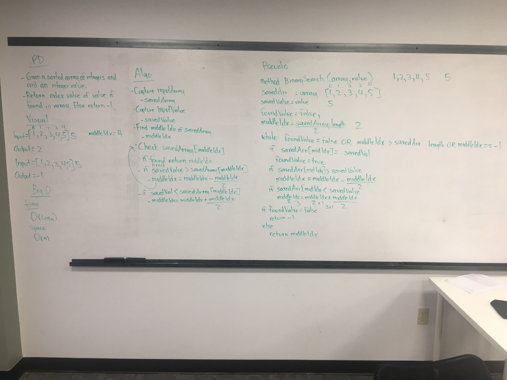
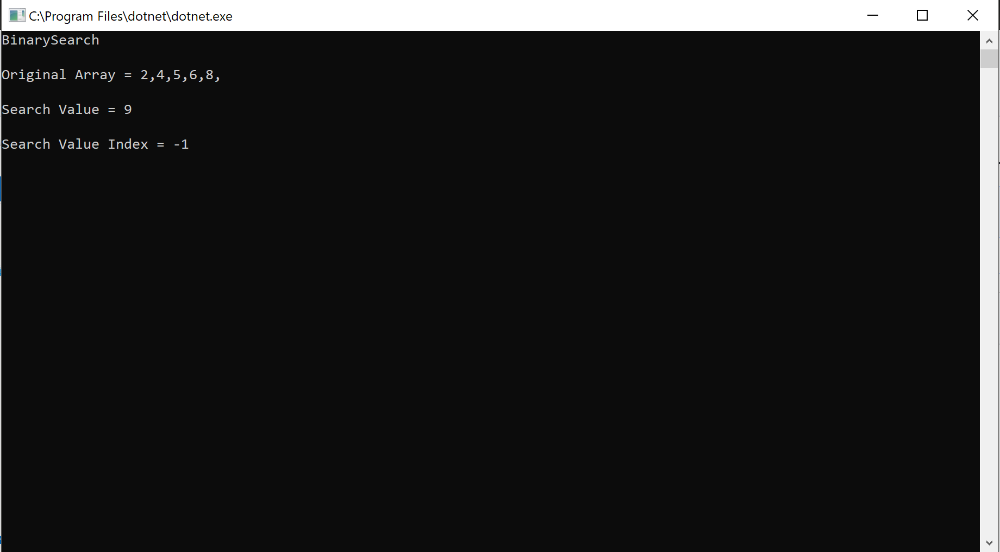

# Code Challenge 03: Binary Search
 - Binary search in a sorted 1D array
## Challenge
- Write a function called BinarySearch which takes in 2 parameters: a sorted array and the search key. Without utilizing any of the built-in methods available to your language, return the index of the array’s element that is equal to the search key, or -1 if the element does not exist.

## Approach & Efficiency
### Approach
- This challenge was only difficult because it was using binary search logic. Typically you could just step your way through the whole array until you find your value but in this case we were given a sorted array of integers. Instead of being lazy since even though the challenge is called Binary Search there is nothing within the challenges instructions that says we have to use binary search logic I decided to humor the title of the challenge.
- The first thing that I had to do was determine where the middle of the input array was and then compare its value to the search key's value. 
- If you don't get lucky and find the search key on the first try you need to shift the middle index to half way between your current middle index and either the lower end of the array or the higher end depending on if the search value was greater than or less than the middle index value. 
- You continue doing this until you either find the value or hit the upper or lower bounds of the array.
### Efficiency
#### Space
O(n)
#### Time
O(Log n)
## Whiteboard

## Solution

