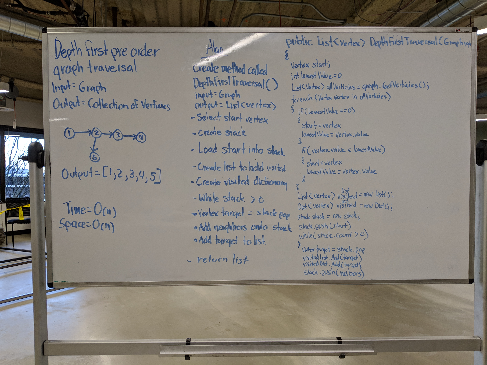

# Code Challenge 33: Depth First
 - Conduct a depth first preorder traversal on a graph.
## Challenge
- Create a function that accepts an adjacency list as a graph, and conducts a depth first traversal. Without utilizing any of the built-in methods available to your language, return a collection of nodes in their pre-order depth-first traversal order.
### Structure and Testing
- Utilize the Single-responsibility principle: any methods you write should be clean, reusable, abstract component parts to the whole challenge. You will be given feedback and marked down if you attempt to define a large, complex algorithm in one function definition.

- Write at least three test assertions for each method that you define.

- Ensure your tests are passing before you submit your solution.

## Approach & Efficiency
### Approach
- I created the method GetEdge()
  - Input = Graph graph
  - Output = List of Verticies preOrder
  - I then created a HashSet called visitedVerticies that will eventually keep track of verticies that I have traversed too.
  - I then created an internal method called FindLowestVertex
    - Input = List of Verticies listOfVerticies
    - Output = lowest valued Vertex in listOfVerticies or null if all verticies have already been visited.
    - I created a Vertex called lowestVertex which will eventually hold the lowest valued Vertex found in the list.
    - I then created an int called lowestValue which is initially set to 0 and will keep track of the lowest value found within a vertex.
    - I then interate through the input listOfVerticies
      - I check the visitedVerticies HashSet to see if the vertex has already been visited.
        - If it hasnt been visited
          - I check to see if lowestVertex is null and set lowestVertex to vertex is it is and set lowestValue to vertex.Value
          - I check to see if vertex.Value is less than lowestValue and if it is then is set lowestVertex to vertex and lowestValue to vertex.Value
        - If the vertex has already been visited then I throw a null. (This allows me to use this as a while condition later ;) )
    - I then return lowestVertex.
  - I then check to see if the graph has any verticies. If it doesnt then I return null.
  - I then create an empty list of Verticies called preOrder that will eventually hold visited Verticies.
  - I then create a List of Verticies called allVerticies and populate it will all Verticies contained in graph using graph.GetVerticies().
  - I then create a Stack that will hold Verticies called stack which will be holding Verticies during the traversal.
  - I then create a Vertex called start and populate it with the lowest valued Vertex in the graph using FindLowestVertex(allVerticies)
  - I then add the Vertex start to the stack and add start to the HashSet visitedVerticies.
  - I then run a while loop that will run whilt the stack has Verticies in it.
    - I then capture the top value from the stack in a Vertex called target using stack.Pop().
    - I then add target to my preOrder List.
    - I then capture target's Edges in a List of Edges called edgeNeighbors using graph.GetNeighbors(target)
    - I then create a new List of Verticies called vertexNeighbors which will eventually hold Vertexes parsed out of the edgeNeighbors.
    - I then run a foreach loop that iterates through edgeNeighbors and adds each edge.Vertex to vertexNeighbors
    - I then run a while loop that will run until FindLowestVertex(vertexNeighbors) throws a null.
      - I then create a Vertex called addingToStack and set its value using FindLowestVertex(vertexNeighbors);
      - I then add addingToStack to the stack.
      - I then add addingToStack to vistiedVerticies.
      - I then remove addingToStack from vertexNeighbors so that FindLowestVertex(vertexNeighbors) will run faster.
  - I then return the preOrder list
  
   
### Efficiency
#### Space
O(n)
#### Time
O(n)

## API
### method GetEdge Required Classes

- Graph class
  - Edge class
  - Vertex class

## Whiteboard
