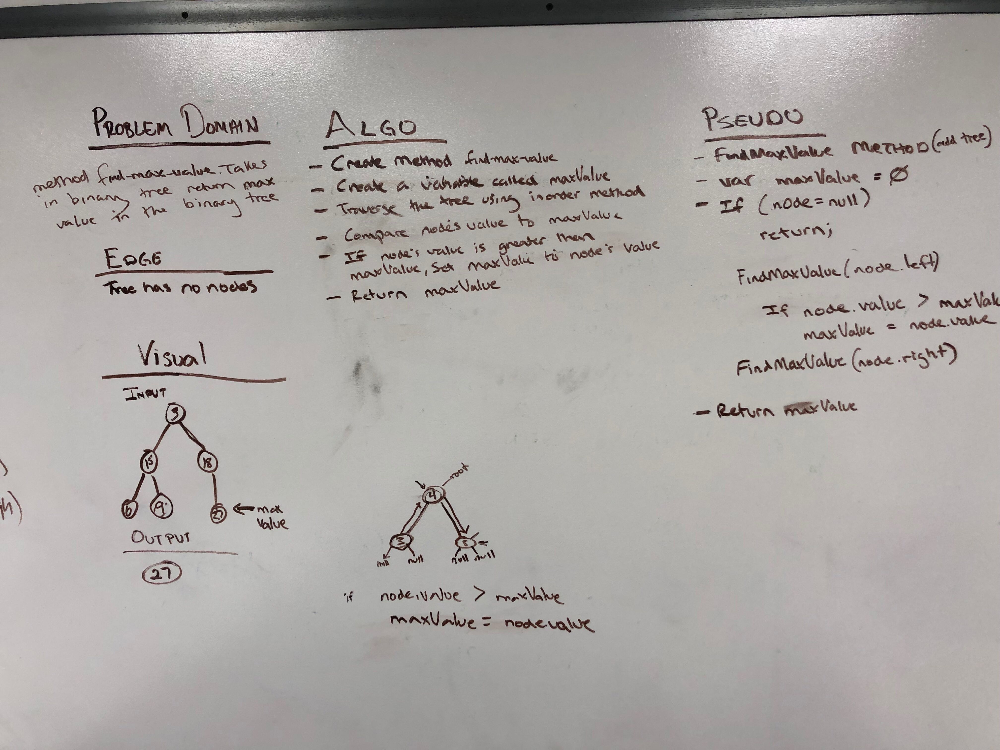

# Code Challenge 18: Find Max Value in Binary Tree
 - Find the Maximum Value in a Binary Tree
## Challenge
- Write a function called find-maximum-value which takes binary tree as its only input. Without utilizing any of the built-in methods available to your language, return the maximum value stored in the tree. You can assume that the values stored in the Binary Tree will be numeric.
### Structure and Testing
- Utilize the Single-responsibility principle: any methods you write should be clean, reusable, abstract component parts to the whole challenge. You will be given feedback and marked down if you attempt to define a large, complex algorithm in one function definition.

- Write at least three test assertions for each method that you define.

- Ensure your tests are passing before you submit your solution.

## Approach & Efficiency
### Approach
- Since I didn't need to modify my Binary Tree I brought in my preexiting Binary Tree and Node class as a dependency.
- I then created the method int FindMaxValue(BinaryTree tree)
  - Inside of the method I created a new int called maxValue and set it to 0;
  - I then split off the Root of the tree into a new Node called root.
  - I then created 2 helper methods within FindMaxValue
    - void Helper(Node helperRoot)
      - Runs a depth first traversal and calls other helper function CompareValues(helperRoot, maxValue).
    - int CompareValues(int incomingValue, int highestValue)
      - Simply compares incomingValue to highestValue and if incomingValue is greater sets highestValue to incomingValue.
      - It then returns highestValue.
  - I then call Helper(root)
  - I then return maxValue.
  
  
### Efficiency
#### Space
O(w)
#### Time
O(n)

## Whiteboard

- Whiteboard Author: Andrew Hinojosa

## API
### FindMaxValue Required Classes
- BinaryTree class
- Node class