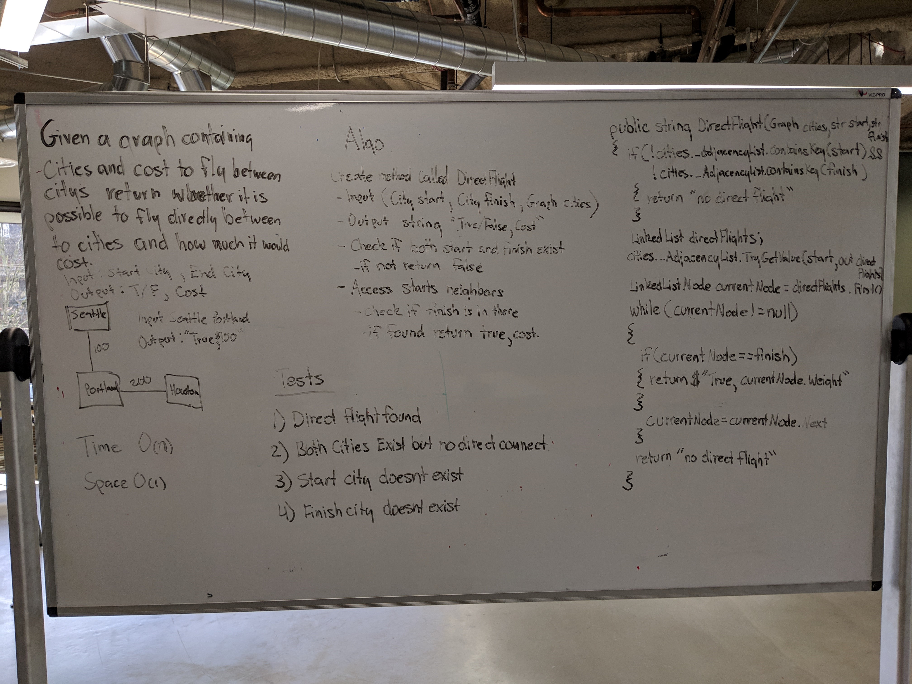

# Code Challenge 32: Get Edge
 - Given a business trip itinerary, and an Alaska Airlines route map, is the trip possible with direct flights? If so, how much will the total trip cost be?
## Challenge
- Write a function based on the specifications above, which takes in a graph, and an array of city names. Without utilizing any of the built-in methods available to your language, return whether the full trip is possible with direct flights, and how much it would cost.
### Structure and Testing
- Utilize the Single-responsibility principle: any methods you write should be clean, reusable, abstract component parts to the whole challenge. You will be given feedback and marked down if you attempt to define a large, complex algorithm in one function definition.

- Write at least three test assertions for each method that you define.

- Ensure your tests are passing before you submit your solution.

## Approach & Efficiency
### Approach
- I created the method GetEdge()
  - Inputs: Graph cities, string startingCity, string endingCity
  - Output: string indicating if direct flight can be acheived.
  - First a list of allCities within cities is retreived 
  - Then two containers called foundStart and foundEnd are created that will hold the target cities if they are found in the allCities list.
  - Then a search of allCities is conducted and foundStart and foundEnd are populated if found.
  - Then a missing data handler is run that checks to see if foundStart and foundEnd were found and will return a string indicating which one is missing from cities graph is data is missing.
  - If all the data exists then a list of foundStart's neighbors (Edge's) is retreived.
  - A search is conducted of the list and if an edge in the neighbors list containes foundEnd's Vertex data then a string is returned saying that a Direct Route is found and the target edges weight is printed as well.
  - If the edge is not found then "No Direct Route Found" is printed.
   
### Efficiency
#### Space
O(1)
#### Time
O(n)

## API
### method GetEdge Required Classes

- Graph class
  - Edge class
  - Vertex class

## Whiteboard
