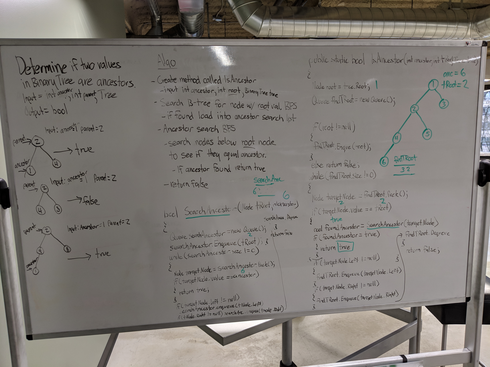

# Snow Day Challenge: Check If Two Binary Tree Values Have an Ancestral Relationship
 - Determine if a Binary Tree is balanced.
## Challenge
- Implement a method with the following signature bool IsAncestor(int A, int B, Node root) that returns true if the value A is an ancestor of the value B in the provided binary tree; the function will return false otherwise.

  - You can assume that the binary tree will have unique values.
  - A classical definition of ancestor nodes: “Any node present in the path from that node to the root node (including the root node)”
### Structure and Testing
- Utilize the Single-responsibility principle: any methods you write should be clean, reusable, abstract component parts to the whole challenge. You will be given feedback and marked down if you attempt to define a large, complex algorithm in one function definition.

- Write at least three test assertions for each method that you define.

- Ensure your tests are passing before you submit your solution.

## Approach & Efficiency
### Approach
- Completed whiteboard but havent coded yet...
    
### Efficiency
#### Space
O(w)
#### Time
O(n)

## API
### IsAncestor Required Classes
- BinaryTree class
- Node class

## Whiteboard
