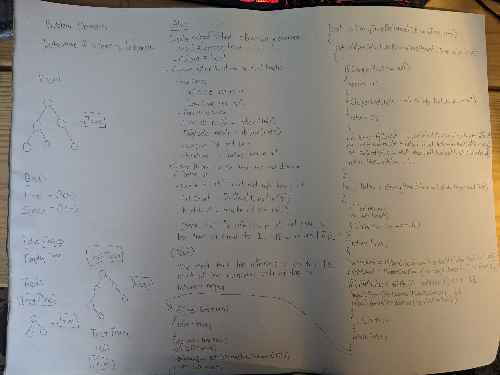

# Snow Day Challenge: Check If A Binary Tree is Balanced
 - Determine if a Binary Tree is balanced.
## Challenge
- Implement a method with the following signature bool IsBinaryTreeBalanced(Node root) that determines if a binary tree is balanced.

- Reminder: We define a balanced binary tree as a binary tree in which the depth of the two subtrees of every node never differ by more than 1.
### Structure and Testing
- Utilize the Single-responsibility principle: any methods you write should be clean, reusable, abstract component parts to the whole challenge. You will be given feedback and marked down if you attempt to define a large, complex algorithm in one function definition.

- Write at least three test assertions for each method that you define.

- Ensure your tests are passing before you submit your solution.

## Approach & Efficiency
### Approach
- Since I didn't need to modify my Binary Tree I brought in my preexiting Binary Tree and Node class as a dependency.
- I then created the method int IsBinaryTreeBalanced(BinaryTree tree)
  - I then split off the Root of the tree into a new Node called root.
  - I then check to see if the input tree has any Nodes and return true if the tree is empty.
  - I then created an bool variable called isBalanced.
  - I then created 2 helper methods within IsBinaryTreeBalanced. 
    - int HelperCalculateBinaryTreeHeight(Node helperRoot)
      - Runs a depth first traversal with two base cases. If a node is null it will return -1. If the node is a leaf it will return 0.
      - I then call HelperCalculateBinaryTreeHeight recursively and set an integer called leftChildHeight to the root.Left recursive call.
      - I then call HelperCalculateBinaryTreeHeight recursively and set an integer called rightChildHeight to the root.Right recursive call.
      - After leftChildHeight and rightChildHeight have been populated I then compare the two height and return the largest of the two with a modifier of +1 to take into account the node that the method is being called from.
    - int HelperIsBinaryTreeBalanced(Node helperRootTwo)
      - I then created two int variables called leftHeight and rightHeight.
      - I then ran HelperCalculateBinaryTreeHeight(helperRootTwo.Left) to set leftHeight's value.
      - I then ran HelperCalculateBinaryTreeHeight(helperRootTwo.Right) to set rightHeight's value.
      - I then compare the absolute difference between leftHeight - rightHeight and make sure that is is less than or equal to 1 as well as making sure that that nodes children are also returning true when fed into HelperIsBinaryTreeBalanced.
        - If the above conditions are met then return true.
        - Else return false.
    
  - I then set isBalanced to HelperIsBinaryTreeBalanced(root)
  - I then return isBalanced.
    
### Efficiency
#### Space
O(h)
#### Time
O(n)

## API
### FindMaxValue Required Classes
- BinaryTree class
- Node class

## Whiteboard
