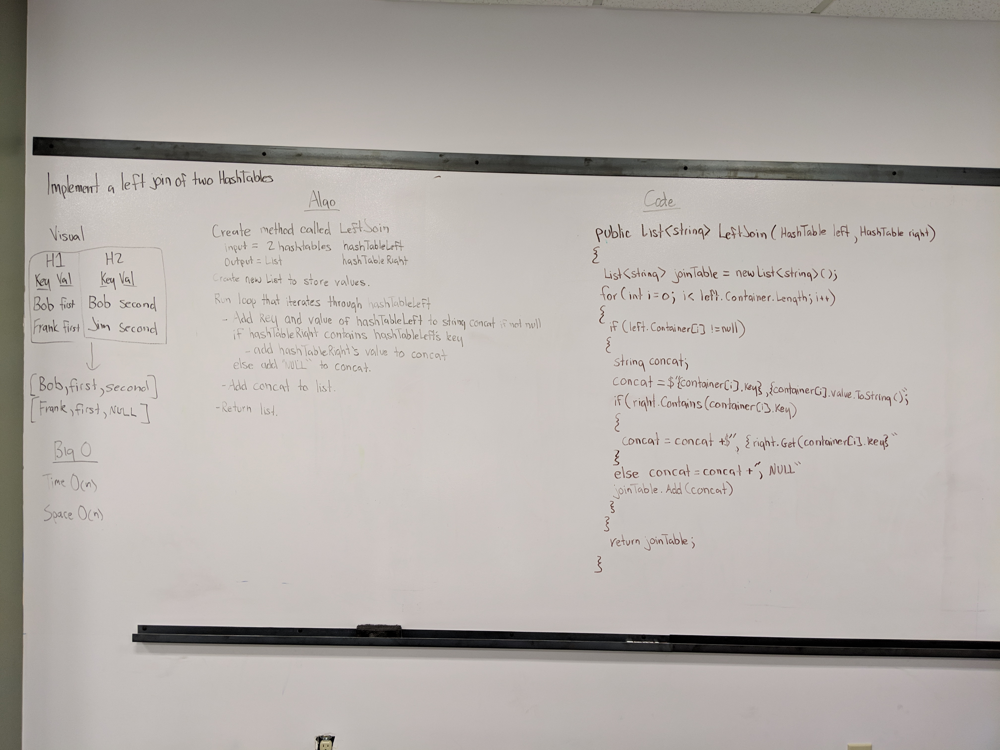

# Code Challenge 28: Left Join of 2 Hashmaps
 - Implement a simplified LEFT JOIN for 2 Hashmaps.
## Challenge
- Write a function that LEFT JOINs two hashmaps into a single data structure.
- The first parameter is a hashmap that has word strings as keys, and a synonym of the key as values.
- The second parameter is a hashmap that has word strings as keys, and antonyms of the key as values.
- Combine the key and corresponding values (if they exist) into a new data structure according to LEFT JOIN logic.
- LEFT JOIN means all the values in the first hashmap are returned, and if values exist in the “right” hashmap, they are appended to the result row. If no values exist in the right hashmap, then some flavor of NULL should be appended to the result row.
- The returned data structure that holds the results is up to you. It doesn’t need to exactly match the output below, so long as it achieves the LEFT JOIN logic.
- Avoid utilizing any of the library methods available to your language.
### Structure and Testing
- Utilize the Single-responsibility principle: any methods you write should be clean, reusable, abstract component parts to the whole challenge. You will be given feedback and marked down if you attempt to define a large, complex algorithm in one function definition.

- Write at least three test assertions for each method that you define.

- Ensure your tests are passing before you submit your solution.

## Approach & Efficiency
### Approach
- I created the method LeftJoin
  - Inputs: HashTable left, HashTable right
  - Output: List of string containing join data for each list entry.
  - I then created a list called joinTable which will eventually hold join data.
  - I then run a for loop that iterates through the left hashTables storage.
    - If the bucket that is being accessed in not Null
      - I pull the target HashNode out of the storage and call it currentNode. 
      - I then run a while loop that will run while currentNode is not equal to null. (This while loop allows me to access collision storage.)
        - I then create a string called concat which will eventually hold key and value data.
        - I then add the currentNodes key and value to concat.
        - I then check to see if HashTable right contains the current node's key value.
          - If it does then I add the right HashTable with the matching key's value to concat.
          - Else I add "NULL" to concat.
        - I then add concat to the joinTable list.
        - I then switch the currentNode to it's next value.
  - I then return joinTable.
    
### Efficiency
#### Space
O(n)
#### Time
O(n)

## API
### method LeftJoin Required Classes

- HashTable and HashNode classes are required.

## Whiteboard
