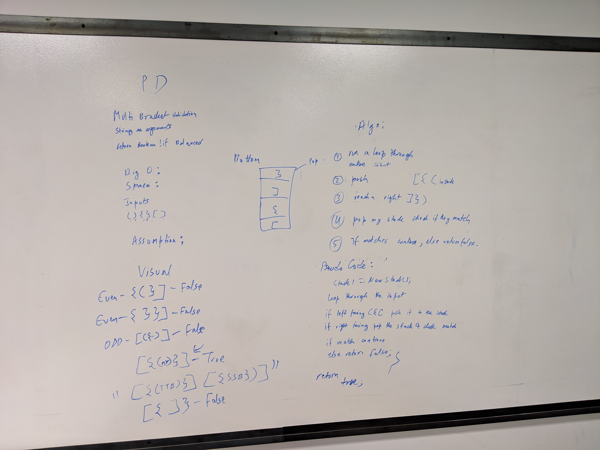

# Code Challenge 13: Multi-Bracket Validation
 - Multi-bracket Validation.
## Challenge
- Your function should take a string as its only argument, and should return a boolean representing whether or not the brackets in the string are balanced. There are 3 types of brackets:
  - Round Brackets : ()
  - Square Brackets : []
  - Curly Brackets : \{}
### Structure and Testing
- Utilize the Single-responsibility principle: any methods you write should be clean, reusable, abstract component parts to the whole challenge. You will be given feedback and marked down if you attempt to define a large, complex algorithm in one function definition.

- Write at least three test assertions for each method that you define.

- Ensure your tests are passing before you submit your solution.

## Approach & Efficiency
### Approach

### Building APIs
- I decided to bring in a standard Stack and Node class and modify them to handle char instead of int.
### Building MultiBracketValidation
- I first created an empty stack called validationStack that will eventually hold right brackets.
- I then created a bool called validation which will serve as a while loop condition and will serve as the return for the method.
- I then parsed the string input into a char[] called charParse.
- I then created an int called counter which will allow me to interate through charParse array.
- I then created a helper function within the method that will pop a character off of the validationStack and compare it to the targetChar and will return true if matched or false if not matched.
- I then created a while loop that runs while validation = true.
  - I created a base case that handles reaching the end of the charArray. It will return validation if the string is balanced.
  - I then capture a character and run it through a switch
    - If the targetChar is a left bracket the switch will push the inverse right bracket into the validation stack and will increase the counter by one.
    - If the targetChar is a right bracket the switch will run CharValidate using targetChar as an input and will compare if the targetChar is the same as validationStack.Pop()s returned value. If the same it will set validation to true else it will set it to false. It will also increase the counter by one.
    - If the character is not a bracket then the counter will just increase.
- Once the while loop ends validation is returned.

### Efficiency
#### Space
O(1)
#### Time
O(n)

## Whiteboard

- Whiteboard Author: Dev Shrestha 

## API
### MultibracketValidation Required Classes
- Node Class
- Stack Class
