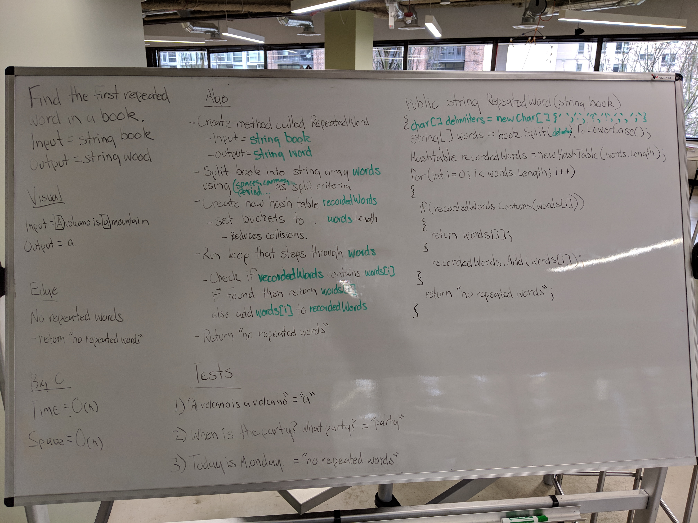

# Code Challenge 26: Find First Repeated Word
 - Find the first repeated word in a book.
## Challenge
- Write a function that accepts a lengthy string parameter.
- Without utilizing any of the built-in library methods available to your language, return the first word to occur more than once in that provided string.
### Structure and Testing
- Utilize the Single-responsibility principle: any methods you write should be clean, reusable, abstract component parts to the whole challenge. You will be given feedback and marked down if you attempt to define a large, complex algorithm in one function definition.

- Write at least three test assertions for each method that you define.

- Ensure your tests are passing before you submit your solution.

## Approach & Efficiency
### Approach
- I created the method string RepeatedWord(string book)
  - I then created a char[] called delimiters and added all common delimiters between words.
  - I then split the input book into an array of words using the delimeters char array as split criteria.
  - I then created a hashtable called recordedWords with total number of buckets equal to total number of words in the words array. (Trying to reduce collisions)
  - I then created a for loop that interates through the word array.
    - If recordedWords HashTable contains words[i] the method returns words[i].
    - Else I add words[i] to recordedWords HashTable.
  - I then added a return at the end of the method that says "no repeated words" to handle no repeated words being found.
    
### Efficiency
#### Space
O(n)
#### Time
O(n)

## API
### method RepeatedWord Required Classes

- HashTable and HashNode classes are required.

## Whiteboard
