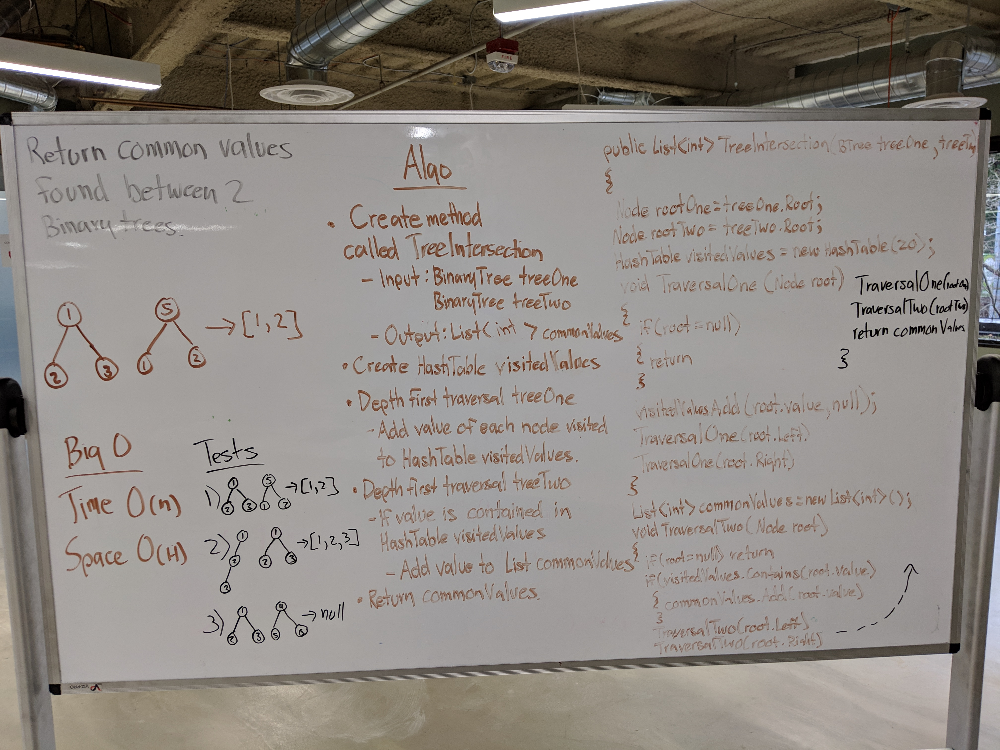

# Code Challenge 27: Tree Intersection
 - Find common values in 2 binary trees.
## Challenge
- Write a function that accepts a lengthy string parameter.
- Without utilizing any of the built-in library methods available to your language, return the first word to occur more than once in that provided string.
### Structure and Testing
- Write a function called tree_intersection that takes two binary tree parameters.
Without utilizing any of the built-in library methods available to your language, return a set of values found in both trees.

- Write at least three test assertions for each method that you define.

- Ensure your tests are passing before you submit your solution.

## Approach & Efficiency
### Approach
- I created the method TreeIntersection()
  - Inputs: 2 BinaryTrees: treeOne and treeTwo
  - Output: List of integer values.
  - First I created a new int list called commonValues which will eventually hold common values found between both trees.
  - I then created a HashTable called visitedValues that will eventually store all of treeOne's values.
  - I then created a helper method called TraversalOne which takes in a Node root and will conduct a depth first traversal and as it touches nodes it will add that nodes value to the HashTable visitedValues in pre-order.
  - I then created another helper method called TraversalTwo which takes in a Node root and will conduct a depth first traversal and as it touches nodes it will check to see if that nodes value in found within the Hashtable visitedValues and if found it will add that nodes value to the list commonValues in pre-order.
  - I then call TraversalOne using treeOne.Root as the Node.
  - I then call TraversalTwo using treeTwo.Root as the Node.
  - I then return the list commonValues
   
### Efficiency
#### Space
O(h)
#### Time
O(n)

## API
### method TreeIntersection Required Classes

- BinaryTree class
- Node class

## Whiteboard
