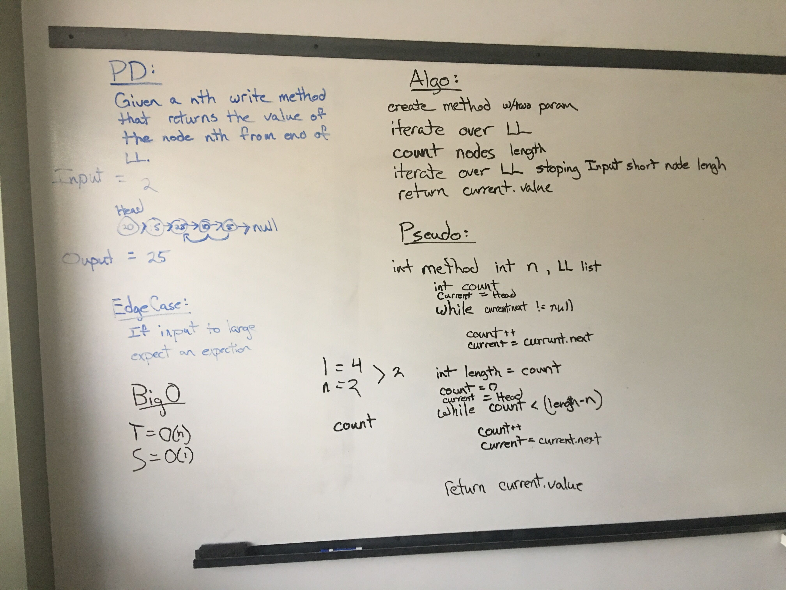

# Code Challenge 07: Kth Value
 - k-th value from the end of a linked list.
## Challenge
- Write a method for the Linked List class which takes a number, k, as a parameter. Return the node’s value that is k from the end of the linked list. You have access to the Node class and all the properties on the Linked List class as well as the methods created in previous challenges.

## Approach & Efficiency
### Approach
- This challenge was easy because of the time I put into creating a Size property inside of my linked list class. Any time an element is added or removed from the linked list size will increase or decrease. 
- My first step of this challenge was to check if the input value k was larger than the size of the linked list. If this was the case I had it return a value of -404.
- If k was less than the size then I ran a for loop that stopped at i < (size - k - 1). As the for loop ran it iterated through the linked list until the node was found.
- The nodes value is then returned as an integer.

### Efficiency
#### Space
O(1)
#### Time
O(n-k) Since size is already calculated I don't have to iterate through the whole list to count it.
## Whiteboard

- Whiteboard Author: Tyler Hood
