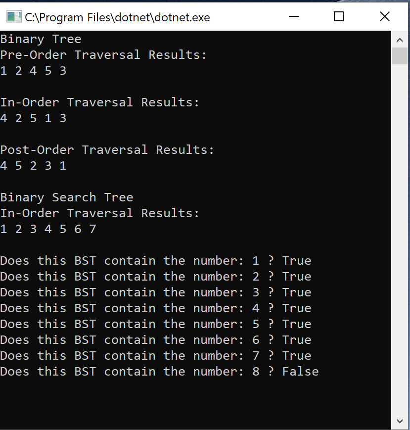

# Lab 15: Trees
 - Implement a Tree
## Challenge
- Create a Node class that has properties for the value stored in the node, the left child node, and the right child node.
- Create a BinaryTree class
  - Define a method for each of the depth first traversals called: 
    - PreOrder 
    - InOrder
    - PostOrder
    - All of which returns an array of the values, ordered appropriately.
- Create a BinarySearchTree class
  - Define a method named Add that accepts a value, and adds a new node with that value in the correct location in the binary search tree.
  - Define a method named Contains that accepts a value, and returns a boolean indicating whether or not the value is in the tree at least once.

- At no time should an exception or stack trace be shown to the end user. Catch and handle any such exceptions and return a printed value or operation which cleanly represents the state and either stops execution cleanly, or provides the user with clear direction and output.
## Structure and Testing
- Utilize the Single-responsibility principle: any methods you write should be clean, reusable, abstract component parts to the whole challenge. You will be given feedback and marked down if you attempt to define a large, complex algorithm in one function definition.

- Write at least three test assertions for each method that you define.

- Ensure your tests are passing before you submit your solution.

## Approach & Efficiency
### Approach
- I created the Node class.
  - Properties: Value, Left, Right
  
- Then I built the BinaryTree class.

  - I created a constructor method that allowed a user to create a new binary tree without a node.
  - I then created a PreOrder method that internally creates a list to hold all of the values then recursively steps through the tree caputuring each nodes value before going left or right. It then feeds the list into a internal PrintValues method which consoles out the values for a user. I then return the values as a list.
  - I then created a InOrder method that internally creates a list to hold all of the values then recursively steps through the tree caputuring each nodes value after going left and before going right. It then feeds the list into a internal PrintValues method which consoles out the values for a user. I then return the values as a list.
  - I then created a PostOrder method that internally creates a list to hold all of the values then recursively steps through the tree caputuring each nodes value after going left and right. It then feeds the list into a internal PrintValues method which consoles out the values for a user. I then return the values as a list.

  
- Then I built the BinarySeachTree class.
  - To keep it simple I decided to inherete all of the BinaryTree classes properties and then added a Size property that will increase as nodes are added to the BST.
  - I then created the Add method which will first check to see if the BST has a node at its Root and if not it will add the node onto the BST as Root. Else it will check to see if the value at the target node is greater or less the incoming value and will traverse the tree until it finds a leaf and then will add the incoming value as a node at its proper location. Once the node is added Size will increase by 1.
  - I then created a Contain method which will traverse a BST searching for an input value and will return a boolean. I created a bool called targetFound and set it to false. I used a series of if statements with the master base case depending of targetFound to be false so that the recursion will stop if the value has already been found. It then will compare root.value to the incoming value and will either return true if it matches or will route the search to either left or right depending on the input value and the value of the node. Once the traversal has completed it will write to the console its result and then will return a bool.

### Efficiency
#### BinaryTree Traversal (Pre, In, PostOrder) methods
#### Space
O(h)
#### Time
O(n)
#### BinarySearchTree Add method
#### Space
O(1)
#### Time
O(log n)
#### BinarySearchTree Contains method
#### Space
O(1)
#### Time
O(log n)

## API
### Class BinaryTree and BinarySearchTree Required Classes
- Both classes require Node class to be able to add nodes to the structures.

## Screenshot of Usage

