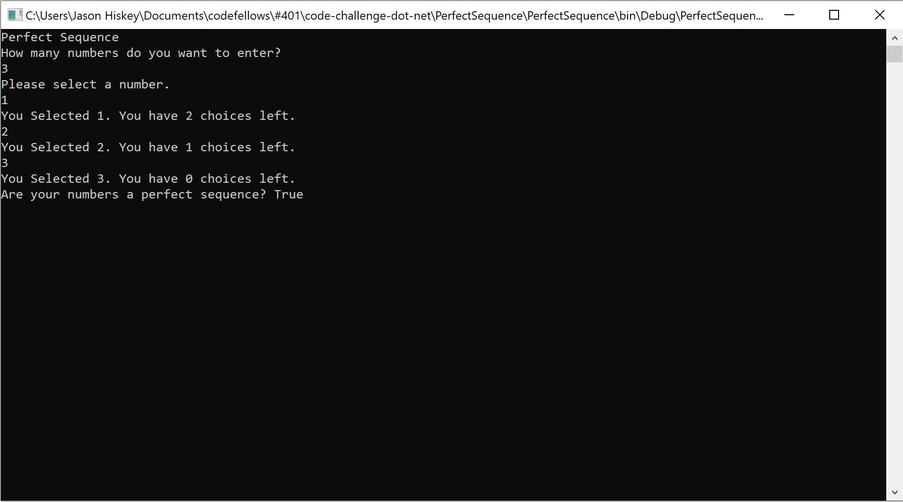

# Leap Year Calculator
 - Given a sequence. Return "Yes" if the sequence is considered a perfect sequence. Otherwise, return "No"
   
  - Perfect Sequences
   A perfect sequence is a sequence such that all of its elements are non-negative integers and the product of all of them is equal to their sum. For example: [2,2], [1,3,2] and [0,0,0,0] are perfect sequences and [4,5,6] and [0,2,-2] are not perfect sequences. Negative numbers of any kind are not valid in a perfect sequence
   
  - Input Format
   An array of integers (may not be sorted)
 - When you input:
 
     [1,3,2]
         
   - Returns:
       True
    
 - When you input:
     
    [5,5,5]
             
      - Returns:
           False     
 
## Screenshot of Output
