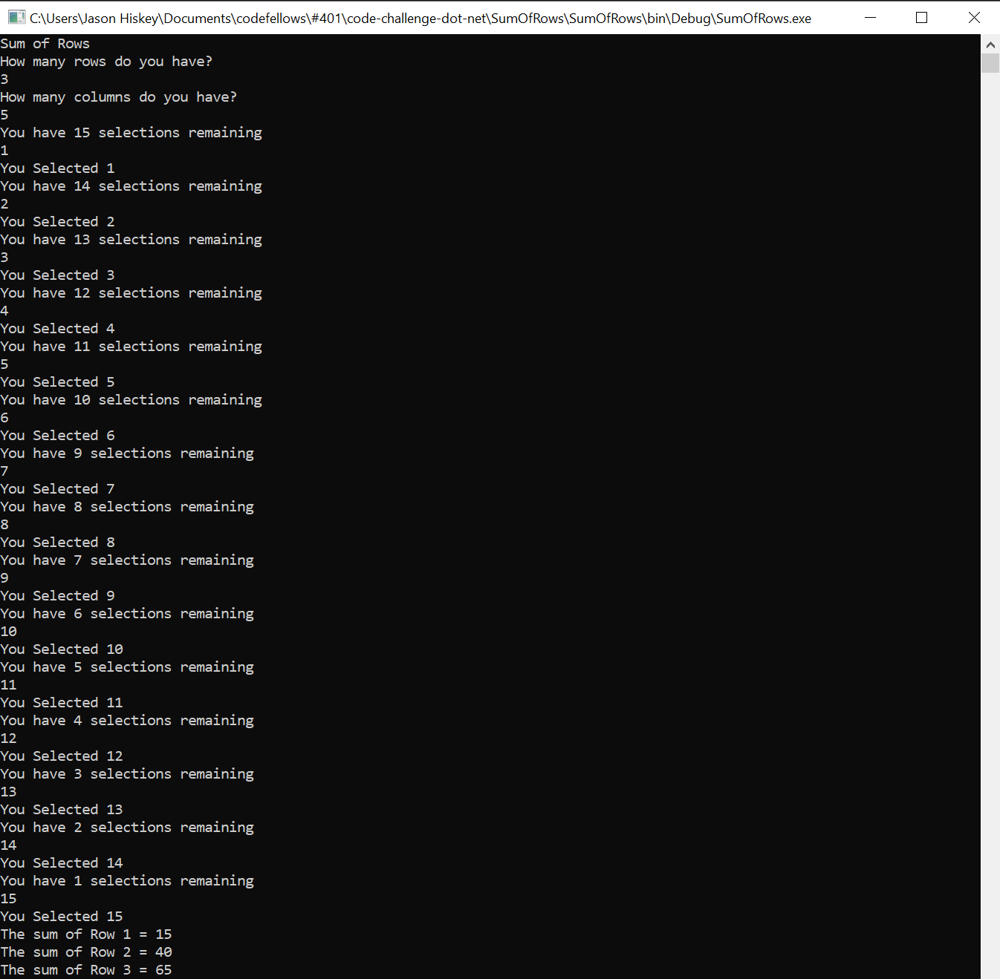

# Sum of Rows
 - Given a matrix of integers. Return the sum of each row in a single dimensional array.
   
  - Input Format
   a multidimensional array with the dimensions of m x n (m = rows, n = columns).
   
  - duplicate integers are possible.
  - Negative numbers are possible
  - both m and n can vary in length
  - The user should specify the length and the width of the array within the console. To populate the numbers, you may randomly generate them, or have the user input one by one.
   
   The method should take in the multidimensional array and return the single dimensional array with the sums
 - When you input:
 
   -  int[,] myArray = new int[3, 5] { { 1, 2, 3, 4, 5 }, { 6, 7, 8, 9, 10 }, { 11, 12, 13, 14, 15 } };
         

   - Returns:
      -  The sum of Row 1 = 15
      -  The sum of Row 2 = 40
      - The sum of Row 3 = 65     
 
## Screenshot of Output
